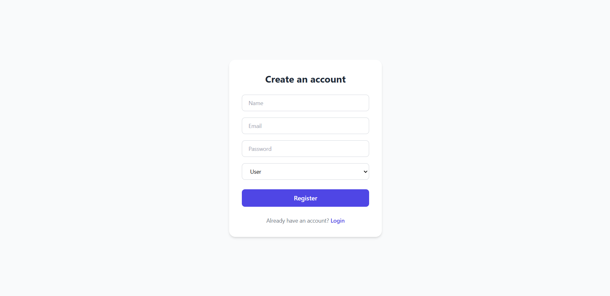
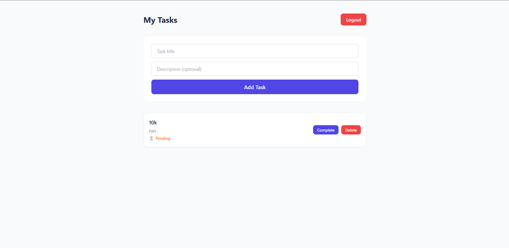

# PrimeTrade — Task Manager

A full-stack task management application built with the MERN stack, featuring JWT-based authentication and role-based user accounts.

**Live demo:** https://task-manager-primetrade-tan.vercel.app/
**Backend API:** https://task-manager-primetrade-api.onrender.com

> Note: the backend is hosted on Render's free tier, which spins down after 15 minutes of inactivity. The first request after a period of inactivity may take 30-60 seconds to respond while the server wakes up.

## Features

- User registration and login with JWT authentication
- Password hashing with bcrypt
- Role-based accounts (User / Admin)
- Create, view, complete, and delete tasks
- Persistent storage with MongoDB
- Responsive UI styled with Tailwind CSS

## Tech Stack

**Frontend:** React, Vite, Tailwind CSS, Axios, React Router
**Backend:** Node.js, Express, MongoDB (Mongoose), JWT, bcrypt
**Deployment:** Vercel (frontend), Render (backend), MongoDB Atlas (database)

## API Endpoints

| Method | Endpoint | Description |
|--------|----------|--------------|
| POST | `/api/v1/auth/register` | Register a new user |
| POST | `/api/v1/auth/login` | Log in and receive a JWT |
| GET | `/api/v1/tasks` | Get all tasks for the logged-in user |
| POST | `/api/v1/tasks` | Create a new task |
| PUT | `/api/v1/tasks/:id` | Update a task (e.g. mark complete) |
| DELETE | `/api/v1/tasks/:id` | Delete a task |

## Running Locally

**Backend**
```bash
cd backend
npm install
```
Create a `.env` file in `backend/`:
```
PORT=5000
MONGO_URI=your_mongodb_connection_string
JWT_SECRET=your_jwt_secret
```
```bash
npm start
```

**Frontend**
```bash
cd frontend
npm install
```
Create a `.env` file in `frontend/` (optional — defaults to localhost if omitted):
```
VITE_API_URL=http://localhost:5000/api/v1
```
```bash
npm run dev
```

## Screenshots


